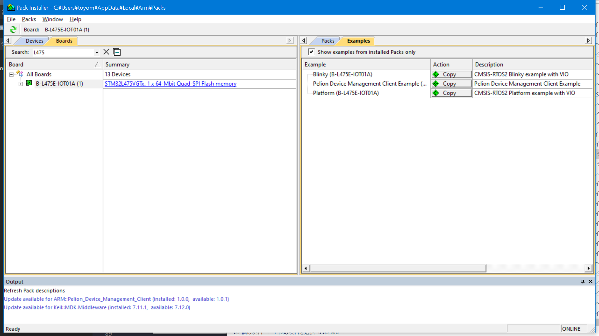

# CMSIS pack for Pelion Device Management Client

## Create CMSIS pack file

```
$ git clone https://github.com/ArmMbedCloud/pdmc_cmsis_pack
$ cd pdmc_cmsis_pack
$ gen_pack.bat
```

## Install the CMSIS pack
Double click the `ARM.Pelion_Device_Management_Client.1.0.0.pack` file.

## Install software
* python 3.x  
https://www.python.org/downloads/
* Git SCM  
https://git-scm.com/downloads
* manifest-tool v1.5.2  
Open command prompt  
```
$ git clone -b v1.5.2 https://github.com/ARMmbed/manifest-tool
$ cd manifest-tool
$ pip install .
```
* Install other python modules
```
$ pip install -U cbor mbed-cloud-sdk
```

## Import example project file
* Launch Pack Installer
* Click `Boards` tab in the left pane
* Put `L475` in the serch box
* Select `B-L475E-IOT01A` board
* Click `Examples` tab in the right pane
* Press `Copy` action button of the `Pelion Device Management Client Example (B-L475E-IOT01A)`
  


## Configure your setting

### Create Pelion Device Management account and developer certificate
* Signing up or logging in to Device Management Portal
https://www.pelion.com/docs/device-management/current/user-account/index.html

* Creating and downloading a developer certificate (mbed_cloud_dev_credentials.c)
https://www.pelion.com/docs/device-management/current/provisioning-process/provisioning-development-devices.html

* Create API key with Administrators group privileges
https://www.pelion.com/docs/device-management/current/user-account/api-keys.html#creating-a-key
* Copy (overwrite) contents of your `mbed_cloud_dev_credentials.c` to `IoT Client` group of the example project
### Initialize the firmware-update-specific resources
* Open Command Prompt, navigate to the project location and create update certificate
```
$ cd pdmc_example
$ manifest-tool init -a <API key> -d arm.com -m example-app --force -q
$ copy /y update_default_resources.c .\RTE\IoT_Client
$ exit
```

### Wi-Fi access point setting
* Open `mbed_cloud_client_user_config.h` in the project and edit Wi-Fi credentials
```
//   <s.64> Wi-Fi SSID
//   <i> String-type value which can be provided for Wi-Fi access point.
//   <i> Default: SSID
#define SSID "SSID"

//   <s.64> Wi-Fi password
//   <i> String-type value which can be provided for Wi-Fi access point.
//   <i> Default: PASSWORD
#define PASSWORD "PASSWORD"
```

## Build and run the example project
* Build the example project by uVision IDE
* Copy `{project}\Objects\pdmc_example_combined.bin` firmware to DIS_L4IOT mass storage drive
* Connect serial termial software with `115200,8,N,1`
* Press reset button (black) on the B-L475E-IOT01A target board

Log output example

```
Mbed Bootloader
No Update image
[DBG ] Active firmware up-to-date
booting...
{LConnecting to WiFi ...
WiFi network connection succeeded!
Start Device Management Client
Using hardcoded Root of Trust, not suitable for production use.
Starting developer flow
Developer credentials already exist, continuing..
Application ready. Build at: Sep  9 2020 11:12:26
Network initialized, registering...
Client registered
Endpoint Name: 01xxxxb180700000000000010011xxxx
Device ID: 01xxxxb180700000000000010011xxxx
Button resource automatically updated. Value 1
Button resource automatically updated. Value 2

```

## Updating the firmware
* Build your program by uVision IDE
* Open Command Prompt and navigate to the project location
```
$ cd pdmc_example
$ manifest-tool update device -p .\Objects\pdmc_example.bin -D <Device ID> -a <API Key>
```
When the update starts, the client tracing log shows:
```
Firmware download requested
Authorization granted
...
Downloading: 100 %
Download completed
Firmware install requested
Authorization granted
```

After this, the device reboots automatically and registers to Device Management.

## See also

* Pack with software components
https://www.keil.com/pack/doc/CMSIS/Pack/html/cp_SWComponents.html